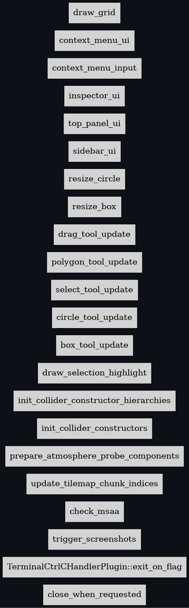

<!-- cargo-rdme start -->

# Gradiance

A sloppy open-source 2D physics sandbox inspired by **Algodoo**, built in **Rust** using the [Bevy](https://bevyengine.org/) game engine (v0.15.3) and [Rapier2d](https://rapier.rs/) physics.

## Status
* **Documentation**: Enforced via `deny(missing_docs)`.
* **Ordering**: Visualized via `bevy_mod_debugdump`.

//! ## Bevy Schedule Graph


<!-- cargo-rdme end -->

## Architecture

Gradiance leverages Bevy's Entity-Component-System (ECS) architecture to create a modular and performant sandbox.

### Core Modules

*   **`src/physics`**: Manages the Rapier2d physics simulation.
    *   Uses `f32` precision (Rapier2d default).
    *   High substep count (12-16) for stiff constraints.
    *   Will house custom constraints like Gears and Pulleys.
*   **`src/geometry`**: Handles 2.5D rendering and Constructive Solid Geometry (CSG).
    *   Implements **2.5D Extrusion**: Shapes are automatically extruded into 3D meshes based on their collision layers.
    *   **Collision Layers as Depth**: The active collision membership bits determine the Z-depth of the extrusion.
        *   Bit 0: Front layer.
        *   Bit 31: Back layer.
        *   Depth is calculated from the range of active bits (`max_bit - min_bit + 1`).
    *   Uses `bevy_prototype_lyon` for path data.
    *   Uses `clipper2` for boolean operations.
*   **`src/input`**: Manages user interaction and tool states.
    *   Implements a `ToolState` machine (Select, Drag, Cut, Sketch, etc.).
    *   Uses Bevy's built-in picking for object selection.
*   **`src/ui`**: Provides the editor interface.
    *   Built with `bevy_egui` for robust inspector panels and toolbars.
*   **`src/scripting`**: (Planned) Lua integration via `bevy_mod_scripting` for user scripts.

### Physics Configuration

*   **Engine**: Rapier2d (0.28)
*   **Precision**: `f32` (Rapier2d default)
*   **Integrator**: Impulse-based (Projected Gauss-Seidel)

## File Structure

```
src/
├── lib.rs          # GamePlugin definition (Root Plugin)
├── main.rs         # App entry point
├── prelude.rs      # Common imports (Bevy, Rapier2d, Gradiance types)
├── physics/        # Physics configuration & Custom Constraints
├── geometry/       # CSG & Vector Rendering
├── input/          # Tool State & Picking
├── ui/             # Editor UI (Egui)
└── scripting/      # Lua Integration
```

## Getting Started

### Prerequisites
*   [Rust Toolchain](https://rustup.rs/) (Stable)
*   **Linux Dependencies**:
    ```bash
    sudo apt-get install g++ pkg-config libx11-dev libasound2-dev libudev-dev libwayland-dev libxkbcommon-dev
    ```

### Development

*   **Run**: `cargo run`
*   **Test**: `cargo test` (Note: Full suite may take time)
*   **Check**: `cargo check` (Fast verification)
*   **Lint**: `cargo clippy`
*   **Format**: `cargo fmt`

For details on the Continuous Integration setup, see [doc/CI.md](doc/CI.md).
