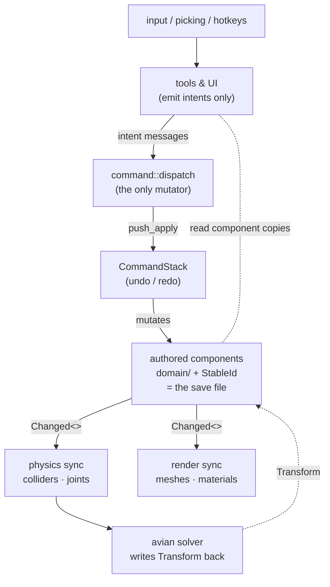
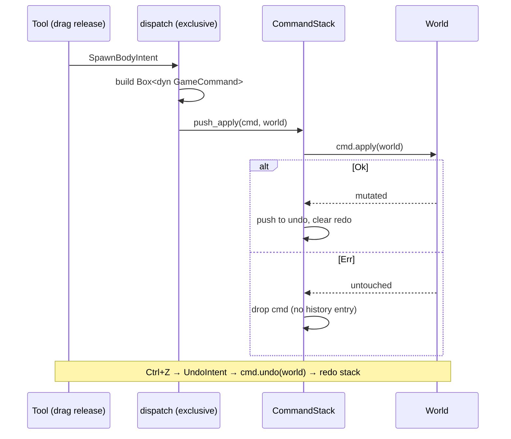
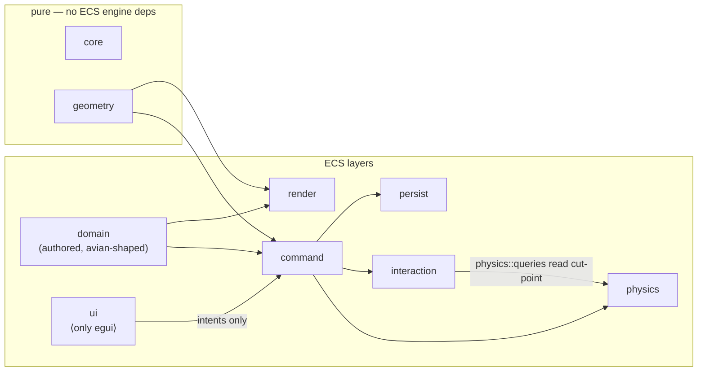
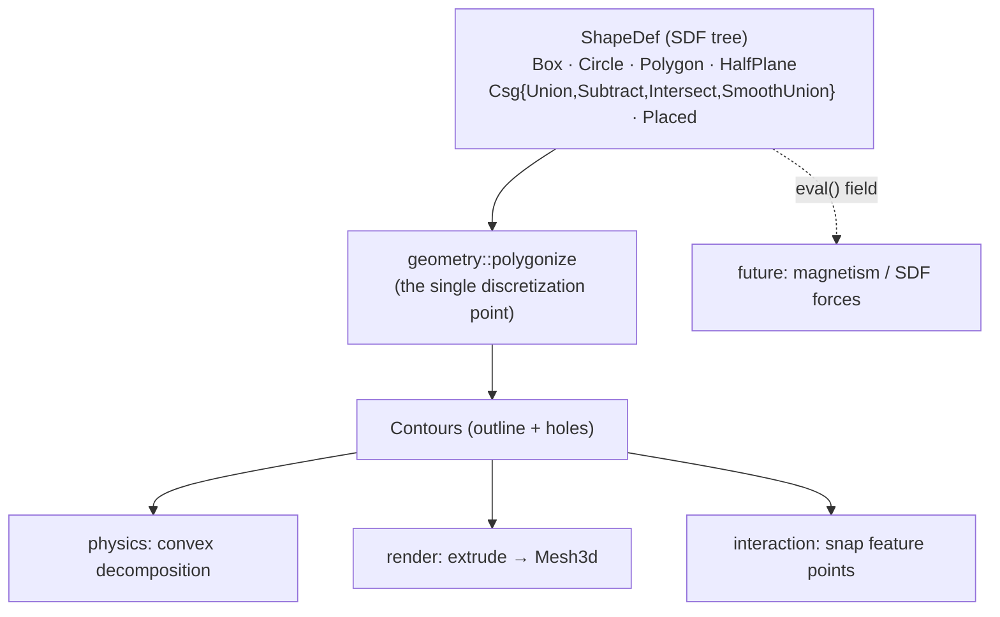
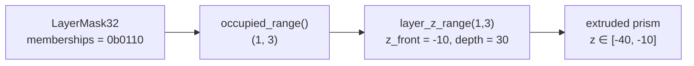

# Gradiance architecture

A visual companion to the crate-level rustdoc (`cargo doc --open`). Every
diagram here renders on GitHub. The invariants these diagrams describe are
mechanically enforced by `tests/boundaries.rs` and CI — see `CLAUDE.md`.

## State classification

Every resource/component in `src/`, by the seam governing its writes (reads
are total, writes are seam-mediated). New state must land in exactly one
section; anything that doesn't fit gets an explicit rationale row at the
bottom — no unclassified state.

### Authored (Edit seam → persisted, undoable, reflect-registered)

| State | Kind | Example / notes |
|---|---|---|
| `StableId` | identity component | on every authored entity; the cross-reference key |
| `Body`, `Joint` | marker components | classify an authored entity |
| `ShapeDef` | component | SDF tree; reflect-opaque leaf |
| `LayerMask32` | component | collision filter *and* render depth |
| `Appearance` | component | fill / emissive |
| `JointDef` | component | kind + anchors + rest rotations, bodies by `StableId` |
| `SelectionGroup` | component | group membership (persisted, undoable via commands) |
| `Transform` (x, y, θ) | component | authored pose, captured as `PosRot`; z/scale derived |
| avian `RigidBody`, `Friction`, `Restitution`, `ColliderDensity`, `GravityScale`, `Sensor`, `LockedAxes` | components | authored physics **is** avian components (de-adapter) |

### Config (settings resources — UI writes directly; invariant-4 exception)

| State | Persisted? | Undoable? | Reflect? | Notes |
|---|---|---|---|---|
| `GridSettings`, `SnapConfig` | scene file | no | yes | grid/snap setup travels with the scene |
| `SimSettings` | scene file | no | yes | applied by `apply_sim_settings` on change; `sim-set` writes it |
| `RenderSettings` | scene file | no | yes | consumed by `toon::apply_render_settings` |
| `DebugSettings` | **no** | no | yes | workstation overlays, not scene state |
| `ToolDefaults` | **no** | no | yes | tool-creation defaults (slider travel limits); consulted at gesture commit time |

### EditorState (non-authored editor tables; not persisted, not undoable)

| State | Notes |
|---|---|
| `ScriptActions` | `register-action` table the context menu surfaces |
| `ScriptInputs`, `StartupScripts`, `ScriptWatch`, `ScriptLog` | script doorway queues + console log |
| `OperationRegistry`, `IntentDispatch` | runtime catalog + intent-bus wiring (static after startup) |
| `LastScenePath`, `AutosavePath`, `StartupScene` | persistence bookkeeping |
| `Selection`, `SelectedJoint` | current selection (entities, never saved) |
| `GameState`, `ToolState` | bevy states: play/pause, active tool |
| `ScaleFrame` | global/local handle axes toggle (F) |
| UI panel state: `SettingsWindow`/`SettingsTab`, `InspectorPanel`, `ContextMenu`, `PlotPanel`, `ScriptConsole` | open/closed + per-panel scratch; egui-side only |

### Transient gesture/preview state (tool-local; invariant 2 — dies with the gesture)

| State | Notes |
|---|---|
| draft tools: `BoxTool`, `CircleTool`, `CutTool`, `GroundTool`, `PolygonTool`, `ConnectorDraft`, `StrutDraft` | anchor points while drawing; commit one intent on release |
| `DragTool`, `SelectGesture`, `ActiveGesture`, `ClickThrough`, `GestureConstraints`, `JointAnchorDrag`, `SuppressSelectPress` | manipulation gesture state |
| `KinematicHold` | kinematic-held pose during a drag (the sanctioned preview write) |
| `MouseSpring`, `MouseTwist` | play-mode grab forces (physics-frame transient) |
| `CursorWorldPos`, `SnappedCursor`, `SnapExclusions`, `PointerButtons`, `PointerOverUi`, `KeyboardCaptured` | per-frame input/picking snapshots |
| `CameraRig` | editor camera pan/zoom (workstation state) |

### Derived (rebuilt by `Changed<>` sync; never serialized, never in undo)

| State | Rebuilt by |
|---|---|
| `Collider`, `CollisionLayers`, `Mass`, contacts | `body_sync` (+ avian internals) |
| live avian joints (`RevoluteJoint`, `PrismaticJoint`, `DistanceJoint`, `JointDamping`), `JointUnresolved`, `PinAnchor` | `joint_sync` |
| `Mesh3d`, `MeshMaterial3d`, `ToonMaterial` | `extrude_sync`, `material_sync` |
| `IdIndex` | `StableId` component hooks |
| `HistoryInfo` | dispatcher (read-only mirror of stack depths) |
| `SubstepTrace` | `record_substep_trace` in avian's `SubstepSchedule` (debug view; rebuilt every physics step while enabled) |

### Doesn't fit cleanly (explicit rationale)

| State | Classification | Rationale |
|---|---|---|
| `CommandStack` | the undo history itself | neither authored nor derived: it *produces* authored state. Private to `command/`; lost on exit by design (history is session state) |
| `PlotHistory` | derived-but-accumulating | a pure read of physics state, but it accumulates samples over time, so it can't be rebuilt from the current frame. Still never persisted/undone; cleared on retarget |
| `FlightRecorder` (dev) | diagnostic accumulator | pure reader of the dispatch/sync pipeline; ring-bounded, dev-feature-gated, dumped on F9 |

## The one-way dataflow

Nothing mutates authored state except commands, and commands only run
from the dispatcher. Tools and UI are *read + emit intent*; everything
downstream of the authored components is *derived* and rebuilt on change.

Key consequence: **loading a scene has no special cases.** Spawn the
authored records and the sync systems reconstruct colliders, meshes, and
engine joints exactly as if the user had drawn them.

## The command lifecycle

Each edit becomes one `Box<dyn GameCommand>`. `apply` either fully
succeeds and is recorded, or fails and vanishes without a trace.

Commands resolve entities by `StableId` at execution time, so they stay
valid across undo/redo cycles that despawn and respawn the same body.

## Layer boundaries (compile-fenced)

`tests/boundaries.rs` scans the source and fails the build if `egui`
escapes `ui/`, `steel` escapes `script/`, or `CommandStack` is named
outside `command/`. (The avian-confinement rule was retired by the
de-adapter collapse — `docs/physics-deadapter-decision.md`: avian is used
directly wherever physics is done, and `physics::queries` is a
convenience/DRY read cut-point, not an abstraction boundary.) This keeps
the UI a thin projection and the scripting seam single.

## Geometry: SDF trees are the base representation

Every body's shape is a signed-distance-function tree. Analytic leaves
compose through CSG operators; **one** discretization point
(`geometry::polygonize`) turns any tree into polygon contours, and every
derived consumer reads through it.

Because CSG is just tree nodes, **cut** = one `Subtract` node and
**merge** = one `Union` node — no mesh booleans. See
`docs/sdf-geometry-decision.md` for why this representation was chosen
and its trade-offs.

## The 2.5D depth mapping

Collision-layer bits double as render depth: bit 0 is front-most, bit 31
back-most, and a body extrudes across exactly the layers it occupies.

The same mask is the physics collision filter, so a body's depth and its
collision set are one authored value.

## Where to start reading

- `src/lib.rs` — the crate docs (module map + this dataflow in text).
- `src/command/mod.rs` — the choke point and the "add a command" recipe.
- `src/domain/` — the authored components; this *is* the save format.
- `src/geometry/sdf.rs` and `contour.rs` — the geometry core, with
  runnable examples.
- `docs/sdf-geometry-decision.md`, `docs/roadmap.md`,
  `docs/feature-feedback.md` — the design decisions and open work.
