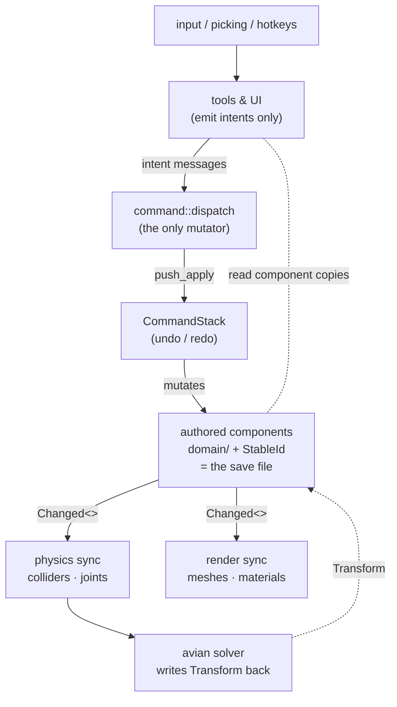
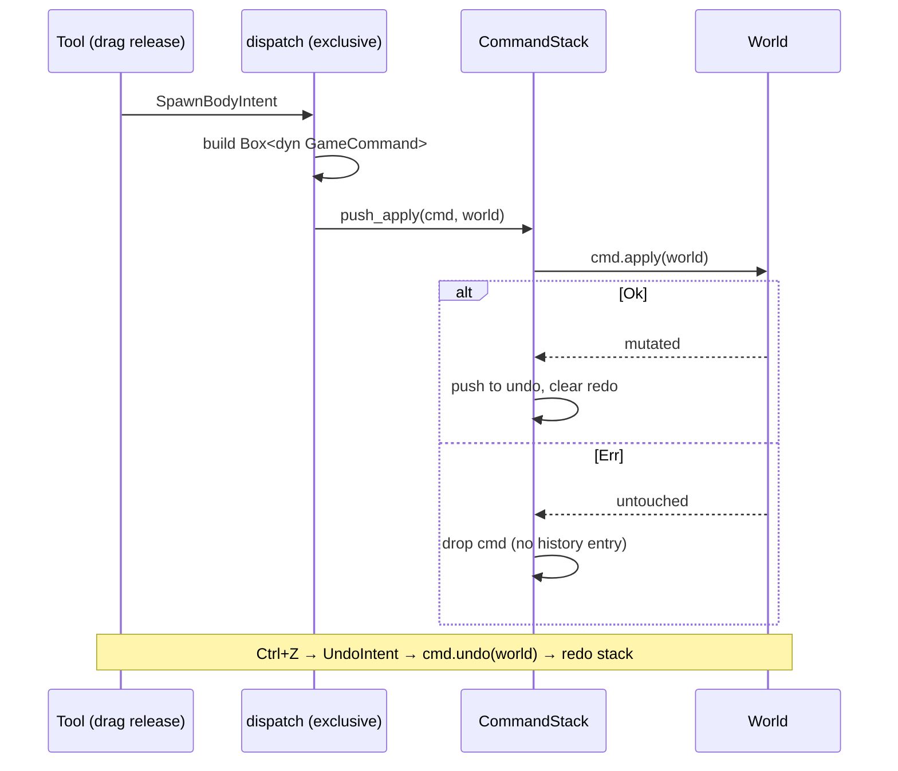
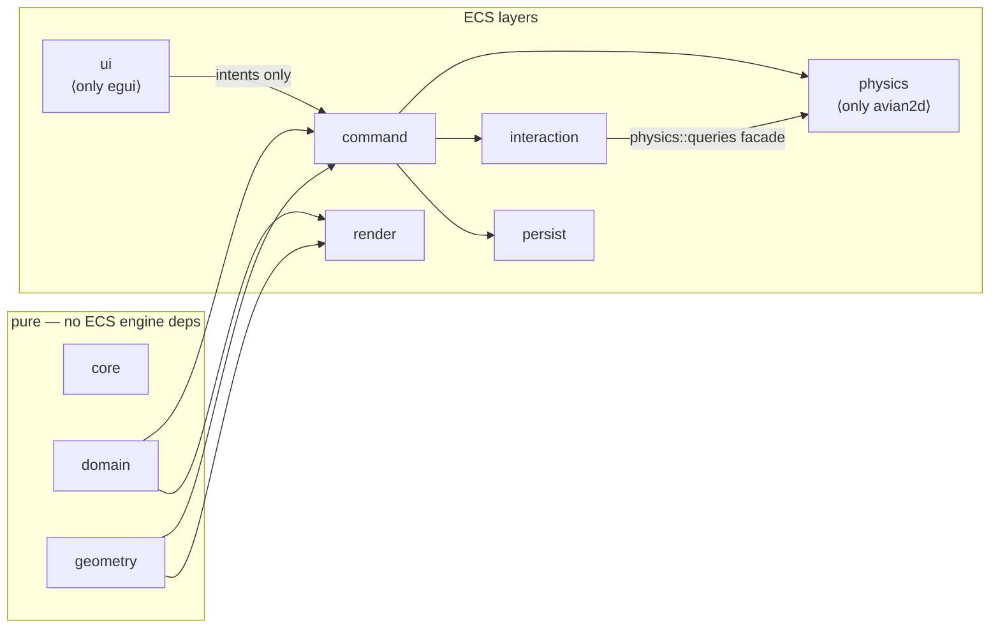
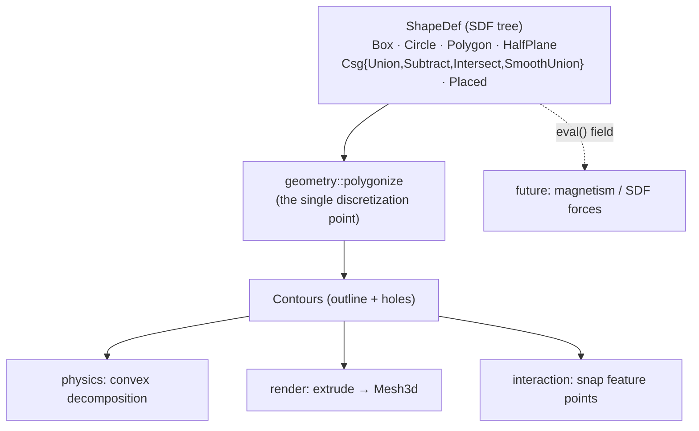
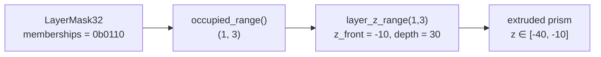

# Gradiance architecture

A visual companion to the crate-level rustdoc (`cargo doc --open`). Every
diagram here renders on GitHub. The invariants these diagrams describe are
mechanically enforced by `tests/boundaries.rs` and CI — see `CLAUDE.md`.

## The one-way dataflow

Nothing mutates authored state except commands, and commands only run
from the dispatcher. Tools and UI are *read + emit intent*; everything
downstream of the authored components is *derived* and rebuilt on change.

Key consequence: **loading a scene has no special cases.** Spawn the
authored records and the sync systems reconstruct colliders, meshes, and
engine joints exactly as if the user had drawn them.

## The command lifecycle

Each edit becomes one `Box<dyn GameCommand>`. `apply` either fully
succeeds and is recorded, or fails and vanishes without a trace.

Commands resolve entities by `StableId` at execution time, so they stay
valid across undo/redo cycles that despawn and respawn the same body.

## Layer boundaries (compile-fenced)

`tests/boundaries.rs` scans the source and fails the build if `avian2d`
escapes `physics/`, `egui` escapes `ui/`, or `CommandStack` is named
outside `command/`. This is what lets the physics engine stay swappable
and the UI stay a thin projection.

## Geometry: SDF trees are the base representation

Every body's shape is a signed-distance-function tree. Analytic leaves
compose through CSG operators; **one** discretization point
(`geometry::polygonize`) turns any tree into polygon contours, and every
derived consumer reads through it.

Because CSG is just tree nodes, **cut** = one `Subtract` node and
**merge** = one `Union` node — no mesh booleans. See
`docs/sdf-geometry-decision.md` for why this representation was chosen
and its trade-offs.

## The 2.5D depth mapping

Collision-layer bits double as render depth: bit 0 is front-most, bit 31
back-most, and a body extrudes across exactly the layers it occupies.

The same mask is the physics collision filter, so a body's depth and its
collision set are one authored value.

## Where to start reading

- `src/lib.rs` — the crate docs (module map + this dataflow in text).
- `src/command/mod.rs` — the choke point and the "add a command" recipe.
- `src/domain/` — the authored components; this *is* the save format.
- `src/geometry/sdf.rs` and `contour.rs` — the geometry core, with
  runnable examples.
- `docs/sdf-geometry-decision.md`, `docs/roadmap.md`,
  `docs/feature-feedback.md` — the design decisions and open work.
